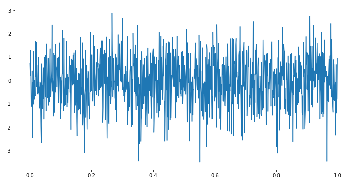
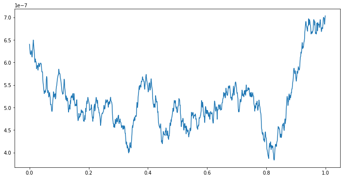

# Colored Noise

In this notebook we are going to discuss various colored noise, such as white noise, in the time and frequency domain and how they relate to brain oscillations.


{:.input_area}
```python
from utils.noise import *
```


General noise is a signal that is largely formed through a [stochasitc process](https://en.wikipedia.org/wiki/Stochastic). When we talk about colored noise we usually refer to an additional underlying pattern that is evident in the signal eventhough there is some amount of randomness involved.
Some types of colored noise follow the general form of $$\frac{1}{f^{\beta}}$$ where β determines the 'color' and properties of the noise. These are the types of noise we will be discussing in this notebook which we will call 'power law noises'.

### White Noise - Time Domain

White noise is an example of a power law noise where β = 0. Below is a time series of white noise. This noise is generated by sampling from a normal distribution and as a result we see the y values mirror the normal distribution - there are many samples close to 0 and fewer samples further away from 0. White noise can also be generated from other distributions such as unifom and poisson distributions which affect the range of the samples.


{:.input_area}
```python
white_data, fs = white_noise_time()
```





### White Noise - Frequency Domain

If we compute a fourier transfrom on our white noise time series signal we will arrive at the frequency domain of our signal. The main characteristic of white noise is that the frequency spectrum is flat - this is where the Power law relationship of 1/f^0 comes from. The total power in any two frequency bands of equal width is the same. For example, the total power from [20, 50] Hz is the same as the total power in [350, 380] Hz because the bandwidths are both the same. For those interested, here's [why.](https://en.wikipedia.org/wiki/Law_of_large_numbers)


{:.input_area}
```python
white_noise_frequency(white_data,fs)
```


Here is a plot to show the power at every frequency. Notice that the trend is a line parallel to the x-axis. This is a result of β = 0.


{:.input_area}
```python
white_welch(white_data,fs)
```


### Pink Noise - Time Domain

Pink noise is our next power law noise which has a β value of β = 1. The time series seems more sporadic than the white noise time series but the pink noise PSD has some interesting features. This is the first noise whose power spectrum resembles a signal found in the brain. The following is an algorithm created by Voss and McCarthy to generate pink noise. 

Voss, R. F., & Clarke, J. (1978). "1/f noise" in music: Music from 1/f noise". Journal of the Acoustical Society of America 63: 258–263.


{:.input_area}
```python
pink_data,fs = pink_noise_time()
```


### Pink Noise - Frequency Domain


{:.input_area}
```python
pink_noise_frequency(pink_data,fs)
```


Notice that in linear space plot (up on left) plots the data in a hard-to-digest way. As a result, pink noise is often shown in log space - the y-axis is scaled such that each subsequent value is 10x larger than the previous. It turns out that this distribution $\frac{1}{f^{1}}$ mysteriously shows up quite a lot in the [universe.](https://www.youtube.com/watch?v=fCn8zs912OE)

When we see the distriution of power in each frequency notice that there is a downward slope. This figure is in log-log space which means that both axes have a logrithmic scaling. Again, this is a result of β = 1. Colloquially, we say that β represents the slope because as β increses, the slope of the welch plot gets steeper. This only makes sense when the scaling in in log-log though.


{:.input_area}
```python
pink_welch(pink_data,fs)
```


### Brown Noise - Time Domain

The last colored noise we will go over is Brown noise which has β = 2. Brown noise, also known as red noise, looks similar to pink noise in both the time domain and frequency domain but with some exaggerated features - the time series is even more sporadic.


{:.input_area}
```python
brown_data, fs = brown_noise_time()
```





### Brown Noise - Frequency Domain


{:.input_area}
```python
brown_noise_frequency(brown_data, fs)
```


Notice that in linear space the power spectrum is slightly harder to digest than the pink noise counterpart. Also note that the slope of the power spectrum is slightly steeper than that of pink noise. These patterns will be more exaggerated as β takes on larger values.


{:.input_area}
```python
brown_welch(brown_data, fs)
```


Compare this distribution to that of pink noise. Notice the scaling to see how the β value affects slope in this log-log plot.
